# BMAD-method - Visual Guide

A comprehensive collection of Mermaid diagrams illustrating every aspect of the BMAD-method framework, from simple workflows to complex architectures.

I made this as I thought it would be helpful.

# OVERKILL - Probably way too much information for new users
## See Navigation Guide at the bottom of the file

---

## Part 1: Story Development Workflows

### 1.1 Story Status Flow - Simple Development
**Purpose**: Basic story progression for straightforward features  
**When to Use**: Low-risk stories, simple UI changes, basic CRUD operations  
**Best For**: Junior developers, quick fixes, well-understood requirements

```mermaid
graph TD
    A["📝 Draft Story"] --> B["✅ Story Approved"]
    B --> C["💻 In Development"]
    C --> D["🔍 Ready for Review"]
    D --> E["✅ Complete"]
    
    style A fill:#ffeb3b,color:#000
    style B fill:#4caf50,color:#fff
    style C fill:#2196f3,color:#fff
    style D fill:#ff9800,color:#fff
    style E fill:#4caf50,color:#fff
```

### 1.2 Story Status Flow - Complex Development
**Purpose**: Complete story lifecycle with QA gates and risk assessment  
**When to Use**: High-risk features, performance-critical code, security features  
**Best For**: Senior teams, regulated industries, mission-critical features

```mermaid
graph TD
    A["📝 Draft Story"] --> B{"🎯 Risk Assessment"}
    B -->|High Risk| C["⚠️ Test Design"]
    B -->|Low Risk| D["✅ Story Approved"]
    C --> D
    D --> E["💻 In Development"]
    E --> F["🧪 Mid-Dev Testing"]
    F --> G{"Test Coverage?"}
    G -->|Gaps Found| E
    G -->|Complete| H["🔍 Ready for Review"]
    H --> I["🔬 QA Review"]
    I --> J{"Quality Gate"}
    J -->|PASS| K["✅ Complete"]
    J -->|CONCERNS| L["📋 Address Issues"]
    J -->|FAIL| E
    L --> M["🔄 Re-Review"]
    M --> K
    
    style A fill:#ffeb3b,color:#000
    style B fill:#e91e63,color:#fff
    style C fill:#ff5722,color:#fff
    style D fill:#4caf50,color:#fff
    style E fill:#2196f3,color:#fff
    style F fill:#9c27b0,color:#fff
    style G fill:#ff9800,color:#fff
    style H fill:#ff9800,color:#fff
    style I fill:#9c27b0,color:#fff
    style J fill:#e91e63,color:#fff
    style K fill:#4caf50,color:#fff
    style L fill:#ffeb3b,color:#000
    style M fill:#ff9800,color:#fff
```

---

## Part 2: SDLC Workflows

### 2.1 BMAD SDLC - Simplified
**Purpose**: High-level overview of the complete development lifecycle  
**When to Use**: Project kickoff, stakeholder presentations, training new team members  
**Best For**: Management overview, quick reference, onboarding

```mermaid
graph TD
    A["💡 Idea"] --> B["📋 Planning"]
    B --> C["🏗️ Architecture"]
    C --> D["✂️ Story Sharding"]
    D --> E["💻 Development"]
    E --> F["🧪 Testing"]
    F --> G["🚀 Deployment"]
    
    style A fill:#e3f2fd,color:#000
    style B fill:#fff3e0,color:#000
    style C fill:#f3e5f5,color:#000
    style D fill:#fce4ec,color:#000
    style E fill:#2196f3,color:#fff
    style F fill:#9c27b0,color:#fff
    style G fill:#4caf50,color:#fff
```

### 2.2 BMAD SDLC - Advanced
**Purpose**: Detailed view showing all agents and decision points  
**When to Use**: Process documentation, team training, workflow optimization  
**Best For**: Technical leads, process improvement, quality assurance

```mermaid
graph TD
    A["💡 Project Idea"] --> B{"Need Research?"}
    B -->|Yes| C["🔍 Analyst: Market Research"]
    B -->|No| D["📋 PM: Create PRD"]
    C --> D
    D --> E{"UX Needed?"}
    E -->|Yes| F["🎨 UX: Design Specs"]
    E -->|No| G["🏗️ Architect: Technical Design"]
    F --> G
    G --> H["👮 PO: Validate Alignment"]
    H --> I{"Documents Aligned?"}
    I -->|No| J["🔄 Revise Documents"]
    I -->|Yes| K["✂️ PO: Shard Documents"]
    J --> H
    K --> L["📝 SM: Draft Story"]
    L --> M{"Risk Level?"}
    M -->|High| N["⚠️ QA: Risk & Test Design"]
    M -->|Low| O["💻 Dev: Implement"]
    N --> O
    O --> P["🧪 QA: Review & Gate"]
    P --> Q{"Quality Gate"}
    Q -->|FAIL| O
    Q -->|PASS| R["✅ Story Complete"]
    R --> S{"More Stories?"}
    S -->|Yes| L
    S -->|No| T["🚀 Epic Complete"]
    
    style A fill:#e3f2fd,color:#000
    style B fill:#ffeb3b,color:#000
    style C fill:#e8f5e9,color:#000
    style D fill:#fff3e0,color:#000
    style E fill:#ffeb3b,color:#000
    style F fill:#e1f5fe,color:#000
    style G fill:#f3e5f5,color:#000
    style H fill:#ff9800,color:#fff
    style I fill:#ffeb3b,color:#000
    style J fill:#ff5722,color:#fff
    style K fill:#ff9800,color:#fff
    style L fill:#e8f5e9,color:#000
    style M fill:#e91e63,color:#fff
    style N fill:#ff5722,color:#fff
    style O fill:#2196f3,color:#fff
    style P fill:#9c27b0,color:#fff
    style Q fill:#e91e63,color:#fff
    style R fill:#4caf50,color:#fff
    style S fill:#ffeb3b,color:#000
    style T fill:#4caf50,color:#fff
```

---

## Part 3: Agent Workflows

### 3.1 Agent Collaboration Flow
**Purpose**: Shows how agents pass work between each other  
**When to Use**: Understanding agent responsibilities, training on agent roles  
**Best For**: New team members, process documentation, role definition

```mermaid
graph TD
    A["🔍 Analyst"] --> B["📋 PM"]
    B --> C["🎨 UX Expert"]
    C --> D["🏗️ Architect"]
    B --> D
    D --> E["👮 PO"]
    E --> F["📝 SM"]
    F --> G["💻 Dev"]
    G --> H["🧪 QA"]
    H --> F
    
    style A fill:#e8f5e9,color:#000
    style B fill:#fff3e0,color:#000
    style C fill:#e1f5fe,color:#000
    style D fill:#f3e5f5,color:#000
    style E fill:#ff9800,color:#fff
    style F fill:#e8f5e9,color:#000
    style G fill:#2196f3,color:#fff
    style H fill:#9c27b0,color:#fff
```

### 3.2 Agent Decision Tree
**Purpose**: Which agent to use for specific tasks  
**When to Use**: Task assignment, choosing the right agent  
**Best For**: Quick reference, delegation decisions

```mermaid
graph TD
    A["🤔 What Do You Need?"] --> B{"Type of Work"}
    B -->|Research| C["🔍 Analyst"]
    B -->|Requirements| D["📋 PM"]
    B -->|Design| E["🎨 UX Expert"]
    B -->|Technical| F{"Technical Type"}
    F -->|Architecture| G["🏗️ Architect"]
    F -->|Implementation| H["💻 Dev"]
    F -->|Testing| I["🧪 QA"]
    B -->|Process| J{"Process Type"}
    J -->|Validation| K["👮 PO"]
    J -->|Story Creation| L["📝 SM"]
    
    style A fill:#ffeb3b,color:#000
    style B fill:#e91e63,color:#fff
    style C fill:#e8f5e9,color:#000
    style D fill:#fff3e0,color:#000
    style E fill:#e1f5fe,color:#000
    style F fill:#9c27b0,color:#fff
    style G fill:#f3e5f5,color:#000
    style H fill:#2196f3,color:#fff
    style I fill:#9c27b0,color:#fff
    style J fill:#ff9800,color:#fff
    style K fill:#ff9800,color:#fff
    style L fill:#e8f5e9,color:#000
```

---

## Part 4: Planning Phase Workflows

### 4.1 Planning Phase Overview
**Purpose**: Complete planning workflow from idea to ready-for-development  
**When to Use**: Project initiation, pre-development phase  
**Best For**: Project managers, technical leads, stakeholders

```mermaid
graph TD
    A["💡 Project Idea"] --> B["📄 Create Brief"]
    B --> C["📋 Create PRD"]
    C --> D{"Need UX?"}
    D -->|Yes| E["🎨 UX Specs"]
    D -->|No| F["🏗️ Architecture"]
    E --> F
    F --> G["✅ Validate"]
    G --> H{"Aligned?"}
    H -->|No| I["🔄 Revise"]
    H -->|Yes| J["✂️ Shard"]
    I --> G
    J --> K["🚀 Ready for Dev"]
    
    style A fill:#e3f2fd,color:#000
    style B fill:#e8f5e9,color:#000
    style C fill:#fff3e0,color:#000
    style D fill:#ffeb3b,color:#000
    style E fill:#e1f5fe,color:#000
    style F fill:#f3e5f5,color:#000
    style G fill:#ff9800,color:#fff
    style H fill:#ffeb3b,color:#000
    style I fill:#ff5722,color:#fff
    style J fill:#ff9800,color:#fff
    style K fill:#4caf50,color:#fff
```

### 4.2 Document Creation Flow
**Purpose**: How core planning documents are created and validated  
**When to Use**: Document generation, quality assurance  
**Best For**: PMs, architects, documentation teams

```mermaid
graph TD
    A["📄 Brief"] --> B["📋 PRD"]
    B --> C["🏗️ Architecture"]
    C --> D["👮 PO Checklist"]
    D --> E{"Quality Check"}
    E -->|Pass| F["✅ Approved Docs"]
    E -->|Fail| G["🔄 Revisions"]
    G --> B
    
    style A fill:#e8f5e9,color:#000
    style B fill:#fff3e0,color:#000
    style C fill:#f3e5f5,color:#000
    style D fill:#ff9800,color:#fff
    style E fill:#e91e63,color:#fff
    style F fill:#4caf50,color:#fff
    style G fill:#ff5722,color:#fff
```

---

## Part 5: Development Phase Workflows

### 5.1 Core Development Cycle
**Purpose**: The iterative story development process  
**When to Use**: Active development phase, sprint execution  
**Best For**: Development teams, scrum masters

```mermaid
graph TD
    A["📚 Story Backlog"] --> B["📝 SM: Draft Story"]
    B --> C["👤 User Review"]
    C --> D{"Approved?"}
    D -->|No| B
    D -->|Yes| E["💻 Dev: Implement"]
    E --> F["✅ Mark Complete"]
    F --> G["🧪 QA Review"]
    G --> H{"Quality Gate"}
    H -->|PASS| I["✅ Done"]
    H -->|FAIL| E
    I --> J{"More Stories?"}
    J -->|Yes| B
    J -->|No| K["🎉 Epic Complete"]
    
    style A fill:#e3f2fd,color:#000
    style B fill:#e8f5e9,color:#000
    style C fill:#ffeb3b,color:#000
    style D fill:#e91e63,color:#fff
    style E fill:#2196f3,color:#fff
    style F fill:#4caf50,color:#fff
    style G fill:#9c27b0,color:#fff
    style H fill:#e91e63,color:#fff
    style I fill:#4caf50,color:#fff
    style J fill:#ffeb3b,color:#000
    style K fill:#4caf50,color:#fff
```

### 5.2 Developer Task Execution
**Purpose**: How developers work through story tasks  
**When to Use**: Task implementation, code development  
**Best For**: Developers, technical leads

```mermaid
graph TD
    A["📋 Read Story"] --> B["📝 Read Task"]
    B --> C["💻 Implement"]
    C --> D["🧪 Write Tests"]
    D --> E["✅ Run Validations"]
    E --> F{"All Pass?"}
    F -->|No| G["🔧 Fix Issues"]
    F -->|Yes| H["☑️ Mark Task Done"]
    G --> C
    H --> I{"More Tasks?"}
    I -->|Yes| B
    I -->|No| J["📄 Update Story"]
    J --> K["✅ Ready for Review"]
    
    style A fill:#e8f5e9,color:#000
    style B fill:#fff3e0,color:#000
    style C fill:#2196f3,color:#fff
    style D fill:#9c27b0,color:#fff
    style E fill:#ff9800,color:#fff
    style F fill:#e91e63,color:#fff
    style G fill:#ff5722,color:#fff
    style H fill:#4caf50,color:#fff
    style I fill:#ffeb3b,color:#000
    style J fill:#ff9800,color:#fff
    style K fill:#4caf50,color:#fff
```

---

## Part 6: Quality Assurance Workflows

### 6.1 QA Test Architecture Flow
**Purpose**: Complete QA process from risk assessment to gate decision  
**When to Use**: Quality assurance, test planning, risk management  
**Best For**: QA engineers, test architects, quality managers

```mermaid
graph TD
    A["📝 Story Draft"] --> B["⚠️ Risk Assessment"]
    B --> C{"Risk Level"}
    C -->|High| D["📋 Test Design"]
    C -->|Low| E["💻 Development"]
    D --> E
    E --> F["🔍 Test Coverage Check"]
    F --> G["📊 NFR Assessment"]
    G --> H["🧪 Full Review"]
    H --> I{"Gate Decision"}
    I -->|PASS| J["✅ Approved"]
    I -->|CONCERNS| K["⚠️ Document Issues"]
    I -->|FAIL| L["❌ Back to Dev"]
    K --> J
    
    style A fill:#e8f5e9,color:#000
    style B fill:#ff5722,color:#fff
    style C fill:#e91e63,color:#fff
    style D fill:#ff9800,color:#fff
    style E fill:#2196f3,color:#fff
    style F fill:#9c27b0,color:#fff
    style G fill:#ff9800,color:#fff
    style H fill:#9c27b0,color:#fff
    style I fill:#e91e63,color:#fff
    style J fill:#4caf50,color:#fff
    style K fill:#ffeb3b,color:#000
    style L fill:#f44336,color:#fff
```

### 6.2 Quality Gate Decision Tree
**Purpose**: How quality gate decisions are made  
**When to Use**: Gate reviews, quality decisions  
**Best For**: QA leads, technical managers

```mermaid
graph TD
    A["🧪 Review Complete"] --> B{"Critical Issues?"}
    B -->|Yes| C["❌ FAIL"]
    B -->|No| D{"P0 Tests Missing?"}
    D -->|Yes| C
    D -->|No| E{"NFR Violations?"}
    E -->|Yes| F{"Severity?"}
    E -->|No| G["✅ PASS"]
    F -->|High| C
    F -->|Medium| H["⚠️ CONCERNS"]
    F -->|Low| H
    
    style A fill:#9c27b0,color:#fff
    style B fill:#e91e63,color:#fff
    style C fill:#f44336,color:#fff
    style D fill:#ff9800,color:#fff
    style E fill:#ff9800,color:#fff
    style F fill:#e91e63,color:#fff
    style G fill:#4caf50,color:#fff
    style H fill:#ffeb3b,color:#000
```

---

## Part 7: Environment Transition Workflows

### 7.1 Web UI to IDE Transition
**Purpose**: Moving from planning (web) to development (IDE)  
**When to Use**: After planning completion, before development starts  
**Best For**: Technical leads, developers transitioning phases

```mermaid
graph TD
    A["🌐 Web UI Planning"] --> B["📄 Save PRD"]
    B --> C["📄 Save Architecture"]
    C --> D["💾 Download Docs"]
    D --> E["📁 Create Project"]
    E --> F["🔧 Install BMAD"]
    F --> G["📂 Copy Docs"]
    G --> H["💻 Open IDE"]
    H --> I["✂️ Shard Documents"]
    I --> J["🚀 Start Development"]
    
    style A fill:#e3f2fd,color:#000
    style B fill:#fff3e0,color:#000
    style C fill:#f3e5f5,color:#000
    style D fill:#ff9800,color:#fff
    style E fill:#2196f3,color:#fff
    style F fill:#4caf50,color:#fff
    style G fill:#ff9800,color:#fff
    style H fill:#2196f3,color:#fff
    style I fill:#ff9800,color:#fff
    style J fill:#4caf50,color:#fff
```

### 7.2 Context Management Flow
**Purpose**: How context is managed across agents and phases  
**When to Use**: Optimizing agent performance, managing large projects  
**Best For**: Technical architects, senior developers

```mermaid
graph TD
    A["📚 Full Context"] --> B{"Context Size?"}
    B -->|Large| C["🔄 Clear Context"]
    B -->|Small| D["➕ Add Files"]
    C --> E["📝 Load Story Only"]
    D --> F["📂 Load Dependencies"]
    E --> G["💻 Focused Work"]
    F --> G
    G --> H{"Performance?"}
    H -->|Degraded| C
    H -->|Good| I["✅ Continue"]
    
    style A fill:#e3f2fd,color:#000
    style B fill:#e91e63,color:#fff
    style C fill:#ff5722,color:#fff
    style D fill:#4caf50,color:#fff
    style E fill:#ff9800,color:#fff
    style F fill:#2196f3,color:#fff
    style G fill:#2196f3,color:#fff
    style H fill:#e91e63,color:#fff
    style I fill:#4caf50,color:#fff
```

---

## Part 8: Specialized Workflows

### 8.1 Brownfield Development Flow
**Purpose**: Working with existing codebases  
**When to Use**: Legacy systems, adding features to existing projects  
**Best For**: Maintenance teams, modernization projects

```mermaid
graph TD
    A["📁 Existing Project"] --> B["📊 Flatten Codebase"]
    B --> C["📄 Document System"]
    C --> D["📋 Create Brownfield PRD"]
    D --> E["🏗️ Update Architecture"]
    E --> F["✂️ Shard for Enhancement"]
    F --> G["💻 Implement Changes"]
    G --> H["🧪 Regression Testing"]
    H --> I["✅ Deploy Changes"]
    
    style A fill:#607d8b,color:#fff
    style B fill:#ff9800,color:#fff
    style C fill:#f3e5f5,color:#000
    style D fill:#fff3e0,color:#000
    style E fill:#f3e5f5,color:#000
    style F fill:#ff9800,color:#fff
    style G fill:#2196f3,color:#fff
    style H fill:#9c27b0,color:#fff
    style I fill:#4caf50,color:#fff
```

### 8.2 Technical Debt Management
**Purpose**: Tracking and resolving technical debt  
**When to Use**: Non-blocking issues, framework limitations  
**Best For**: Long-term maintenance, quality improvement

```mermaid
graph TD
    A["🐛 Issue Found"] --> B{"Blocking?"}
    B -->|Yes| C["🔧 Fix Now"]
    B -->|No| D["📝 Document TD"]
    D --> E["🏷️ Assign TD-ID"]
    E --> F["⚠️ Accept CONCERNS"]
    F --> G["📋 Track in Backlog"]
    G --> H{"Sprint Planning"}
    H -->|Prioritized| I["🔧 Fix TD"]
    H -->|Deferred| J["📊 Review Next Sprint"]
    I --> K["✅ Mark Resolved"]
    
    style A fill:#ff5722,color:#fff
    style B fill:#e91e63,color:#fff
    style C fill:#f44336,color:#fff
    style D fill:#ffeb3b,color:#000
    style E fill:#ff9800,color:#fff
    style F fill:#ffeb3b,color:#000
    style G fill:#9c27b0,color:#fff
    style H fill:#e91e63,color:#fff
    style I fill:#2196f3,color:#fff
    style J fill:#ff9800,color:#fff
    style K fill:#4caf50,color:#fff
```

---

## Part 9: Communication Workflows

### 9.1 Stakeholder Communication Flow
**Purpose**: Information flow between technical team and stakeholders  
**When to Use**: Status updates, requirement clarification  
**Best For**: Project managers, team leads


### 9.2 Inter-Agent Communication
**Purpose**: How agents share information through files  
**When to Use**: Understanding data flow, debugging workflows  
**Best For**: System architects, process engineers

```mermaid
graph TD
    A["📋 PM Agent"] --> B["📄 docs/prd.md"]
    B --> C["🏗️ Architect Agent"]
    C --> D["📄 docs/architecture.md"]
    D --> E["👮 PO Agent"]
    E --> F["📁 docs/epics/"]
    F --> G["📝 SM Agent"]
    G --> H["📁 docs/stories/"]
    H --> I["💻 Dev Agent"]
    I --> J["📄 Updated Story Files"]
    J --> K["🧪 QA Agent"]
    K --> L["📁 docs/qa/"]
    
    style A fill:#fff3e0,color:#000
    style B fill:#fce4ec,color:#000
    style C fill:#f3e5f5,color:#000
    style D fill:#fce4ec,color:#000
    style E fill:#ff9800,color:#fff
    style F fill:#fce4ec,color:#000
    style G fill:#e8f5e9,color:#000
    style H fill:#fce4ec,color:#000
    style I fill:#2196f3,color:#fff
    style J fill:#fce4ec,color:#000
    style K fill:#9c27b0,color:#fff
    style L fill:#fce4ec,color:#000
```

---

## Part 10: Meta Summaries - Process Navigation

### 10.1 By Goal: Starting a New Project
**Purpose**: Complete greenfield project workflow  
**Who**: Product teams starting from scratch  
**When**: New product development, MVP creation  
**Best For**: Startups, innovation teams, new features


### 10.2 By Goal: Enhancing Existing Project
**Purpose**: Brownfield enhancement workflow  
**Who**: Maintenance teams, modernization projects  
**When**: Adding features to legacy systems  
**Best For**: Enterprise teams, established products


### 10.3 By Function: Quality Assurance Focus
**Purpose**: Complete quality workflow  
**Who**: QA engineers, test architects  
**When**: Test planning, quality gates  
**Best For**: Regulated industries, high-reliability systems

```mermaid
graph TD
    A["QA Start"] --> B["1.2 Story Status Flow - Complex"]
    B --> C["6.1 QA Test Architecture Flow"]
    C --> D["6.2 Quality Gate Decision Tree"]
    D --> E["8.2 Technical Debt Management"]
    
    style A fill:#9c27b0,color:#fff
    style B fill:#e91e63,color:#fff
    style C fill:#9c27b0,color:#fff
    style D fill:#e91e63,color:#fff
    style E fill:#ffeb3b,color:#000
```

### 10.4 By Business Process: Agile Sprint
**Purpose**: Sprint execution workflow  
**Who**: Scrum teams, agile practitioners  
**When**: Sprint planning and execution  
**Best For**: Iterative development, continuous delivery

```mermaid
graph TD
    A["Sprint Start"] --> B["5.1 Core Development Cycle"]
    B --> C["1.1 Story Status Flow - Simple"]
    C --> D["5.2 Developer Task Execution"]
    D --> E["6.1 QA Test Architecture Flow"]
    E --> F["Next Story"]
    F --> B
    
    style A fill:#ff9800,color:#fff
    style B fill:#2196f3,color:#fff
    style C fill:#ffeb3b,color:#000
    style D fill:#2196f3,color:#fff
    style E fill:#9c27b0,color:#fff
    style F fill:#4caf50,color:#fff
```

---

## Navigation Guide

### For New Users
1. Start with **2.1 BMAD SDLC - Simplified**
2. Review **3.1 Agent Collaboration Flow**
3. Study **4.1 Planning Phase Overview**
4. Practice with **1.1 Story Status Flow - Simple**

### For Experienced Users
1. Master **2.2 BMAD SDLC - Advanced**
2. Optimize with **7.2 Context Management Flow**
3. Implement **6.1 QA Test Architecture Flow**
4. Handle complexity with **1.2 Story Status Flow - Complex**

### For Project Managers
1. Focus on **4.1 Planning Phase Overview**
2. Use **9.1 Stakeholder Communication Flow**
3. Monitor with **5.1 Core Development Cycle**
4. Report using **3.1 Agent Collaboration Flow**

### For Developers
1. Master **5.2 Developer Task Execution**
2. Follow **1.1 Story Status Flow - Simple**
3. Understand **9.2 Inter-Agent Communication**
4. Apply **7.2 Context Management Flow**

### For QA Engineers
1. Start with **6.1 QA Test Architecture Flow**
2. Apply **6.2 Quality Gate Decision Tree**
3. Track with **8.2 Technical Debt Management**
4. Execute **1.2 Story Status Flow - Complex**

---

## Quick Reference Matrix

| Workflow Type | Simple Project | Complex Project | Brownfield | High Risk |
|--------------|---------------|-----------------|------------|-----------|
| **Planning** | 4.1 | 2.2 | 8.1 | 6.1 |
| **Development** | 1.1, 5.2 | 1.2, 5.1 | 8.1 | 6.1 |
| **Testing** | 1.1 | 6.1, 6.2 | 8.1 | 6.2 |
| **Management** | 2.1 | 2.2 | 8.2 | 9.1 |

---

## Color Legend

- 🟡 **Yellow** (#ffeb3b): Decision points, questions
- 🟢 **Green** (#4caf50): Success, completion, approval
- 🔵 **Blue** (#2196f3): Development, implementation
- 🟣 **Purple** (#9c27b0): Testing, QA, validation
- 🟠 **Orange** (#ff9800): Review, validation, checks
- 🔴 **Red** (#f44336, #e91e63): Failures, critical decisions
- 🟤 **Brown** (#795548): Brownfield, legacy
- ⚪ **Light** (various pastels): Information, documentation

---

*This visual guide represents the complete BMAD-METHOD framework. Each diagram is designed to be clear on both light and dark backgrounds with high contrast between fill and text colors.*

**Version**: 1.0  
**Last Updated**: Based on BMAD-METHOD documentation  
**Created For**: BMAD-METHOD practitioners and teams
