**Helpful Learning BMAD Diagrams**

---

## PROMPT
Make a markdown file I can download with mermaid diagrams for: 1. Story Status flow (simplified) 2. Story Status flow (advanced) 3. SDLC (simplified) 4. SDLC (advanced)
### Settings
Sonnet 4.0

---

## RESPONSE
#### Response
Perfect! I've created a comprehensive markdown file with all four Mermaid diagrams you requested:

## 📊 **What's Included:**

### **1. Story Status Flow (Simplified)**

- Basic story progression from Draft → Done
- Clear decision points and status changes
- Color-coded for easy visual understanding

### **2. Story Status Flow (Advanced)**

- Complete story lifecycle with QA integration
- Risk assessment and test design phases
- Mid-development checkpoints and quality gates
- Technical debt management integration

### **3. SDLC (Simplified)**

- High-level software development lifecycle
- Major phases from idea to maintenance
- Clean, easy-to-understand flow

### **4. SDLC (Advanced) - Complete BMAD Method**

- Full planning phase workflow (Web UI)
- Complete development cycle (IDE)
- QA command integration (*risk, *design, *trace, *nfr, *review, *gate)
- Technical debt management process
- Post-epic activities

## 🎯 **Additional Features:**

- **QA Agent Command Reference** with flow integration
- **Greenfield vs Brownfield** process variations
- **Key Success Metrics** and performance indicators
- **Color-coded diagrams** for visual clarity

## 📥 **Ready to Download**

The artifact contains everything in a single markdown file that you can:

- Download and save locally
- View in any markdown editor with Mermaid support
- Share with team members
- Use for documentation and training

The diagrams capture your actual BMAD implementation process, including the lessons learned and improvements you've discovered during your videoFabricWithZoom project! 🚀✨

---

#### Document (Artifact)
# BMAD Method Process Flow Diagrams

This document contains comprehensive process flow diagrams for the BMAD Method, optimized for dark mode viewing and broken into digestible sections for better readability.

## 1. Story Status Flow (Simplified)

**What it shows:** Basic story lifecycle from creation to completion  
**When to use:** Quick reference for story status progression and decision points  
**Best for:** New team members learning the process

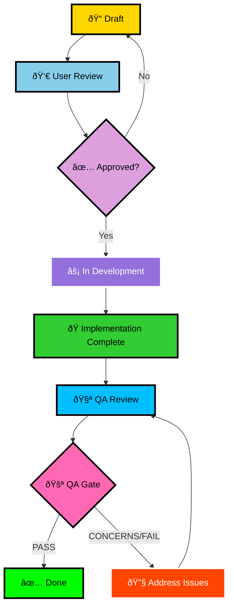

## 2. Story Creation & Planning Flow

**What it shows:** How stories are created with optional risk assessment  
**When to use:** Understanding when to involve QA early in story planning  
**Best for:** Planning complex or high-risk features

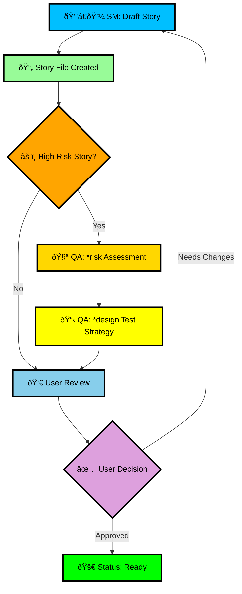

## 3. Development Execution Flow

**What it shows:** Core development cycle with optional mid-development QA  
**When to use:** Understanding the development phase workflow  
**Best for:** Developers and project managers tracking progress

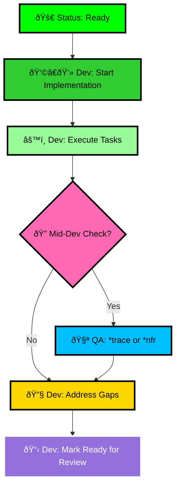

## 4. Quality Assurance Flow

**What it shows:** QA review process with gate decisions  
**When to use:** Understanding quality checkpoints and outcomes  
**Best for:** QA team members and quality-focused workflows

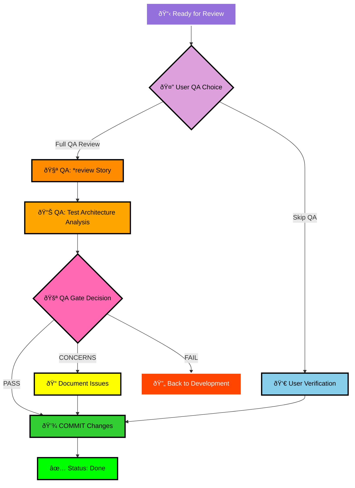

## 5. BMAD Planning Phase (Web UI)

**What it shows:** Complete planning workflow from idea to architecture  
**When to use:** Starting a new project or major feature  
**Best for:** Project kickoff and strategic planning

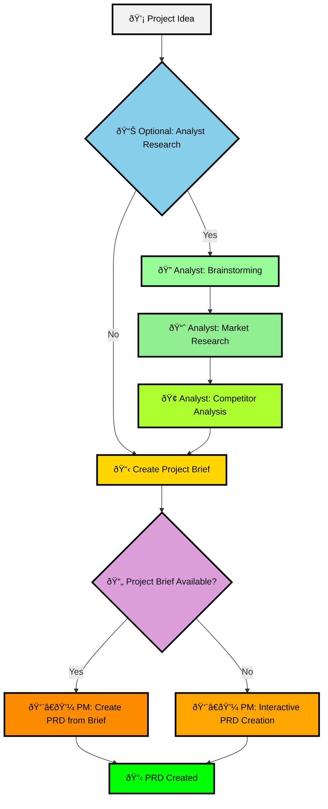

## 6. Architecture & UX Design Phase

**What it shows:** Architecture creation with optional UX integration  
**When to use:** After PRD completion, before development  
**Best for:** Technical leads and architects

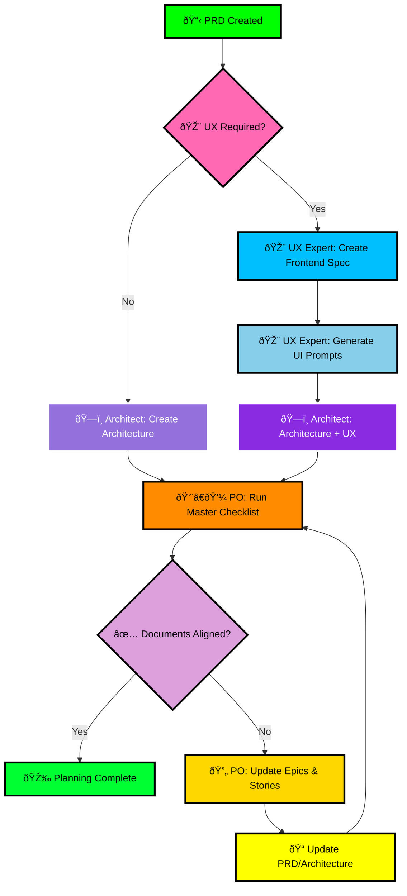

## 7. Transition to Development

**What it shows:** Moving from planning to development execution  
**When to use:** After planning phase completion  
**Best for:** Understanding the handoff process

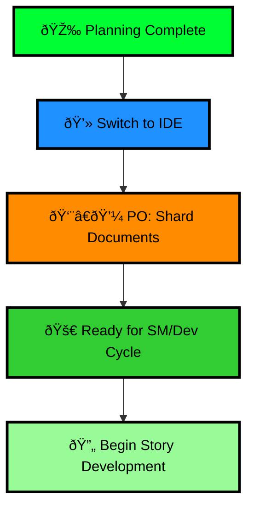

## 8. QA Command Reference

**What it shows:** All QA agent commands and their purposes  
**When to use:** Reference for QA workflow and command usage  
**Best for:** QA team members and process understanding

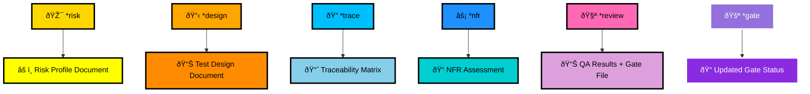

## 9. QA Command Flow

**What it shows:** Recommended sequence for QA commands  
**When to use:** Planning QA activities for a story  
**Best for:** Understanding when to use each QA command

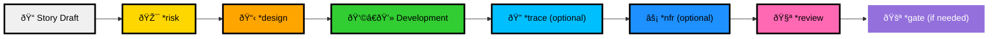

## 10. Technical Debt Management

**What it shows:** How technical debt is identified, tracked, and managed  
**When to use:** When QA identifies non-blocking issues  
**Best for:** Understanding debt acceptance vs. fixing decisions

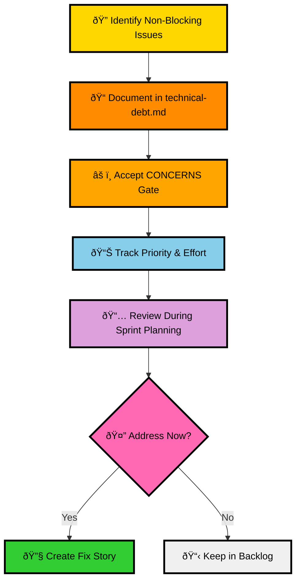

## 11. Greenfield vs Brownfield Decision

**What it shows:** Different workflows for new vs existing projects  
**When to use:** Deciding which BMAD workflow to follow  
**Best for:** Project initialization and process selection

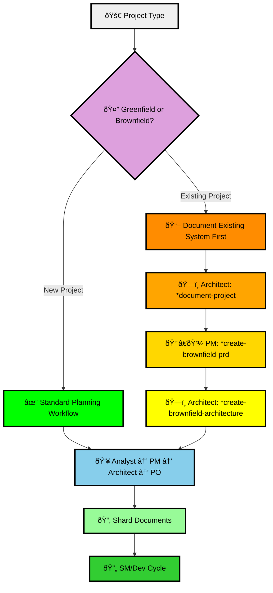

## 12. Epic Completion & Next Steps

**What it shows:** What happens after completing an epic  
**When to use:** End of epic planning and transition  
**Best for:** Understanding post-development activities

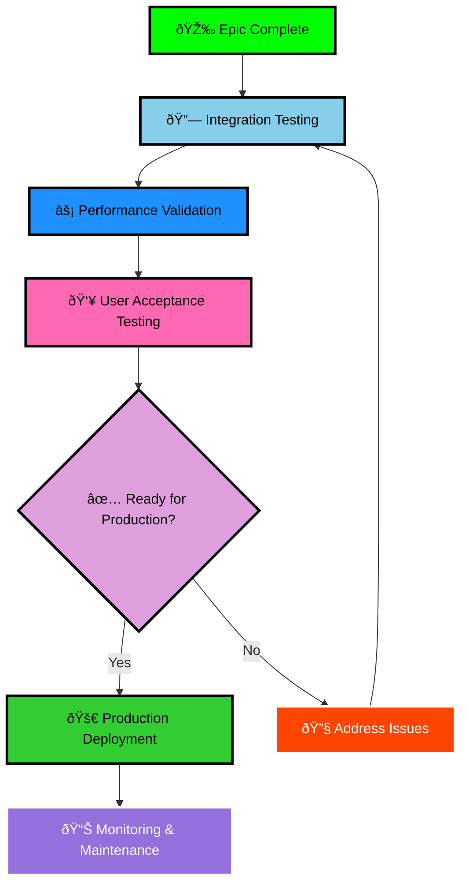

## Key Success Metrics

### Quality Indicators

- **Story Clarity Score**: Target 9+ / 10
- **QA Quality Score**: Target 90+ / 100
- **Gate Pass Rate**: Target 85%+ PASS
- **Technical Debt**: Managed, not blocking

### Performance Metrics

- **Development Velocity**: Stories per week
- **Context Efficiency**: Agent response quality over time
- **Error Rate**: Missing file references, alignment issues
- **Time to First Code**: Planning phase duration

## Color Legend

- 🟡 **Bright Yellow/Gold** (#FFD700, #FFFF00): Draft states, planning, risk assessment
- 🟢 **Bright Green** (#00FF00, #32CD32): Success, completion, ready states
- 🔵 **Bright Blue** (#00BFFF, #1E90FF): Information, QA processes, reviews
- 🟠 **Bright Orange** (#FF8C00, #FFA500): Planning phases, architecture work
- 🟣 **Purple** (#9370DB, #8A2BE2): Quality gates, decisions - WHITE TEXT
- 🔴 **Red-Orange** (#FF4500): Issues, failures, rework needed - WHITE TEXT
- ⚪ **Light Gray** (#F0F0F0): Neutral processes, starting points

---

_These diagrams represent the complete BMAD Method workflow optimized for dark mode viewing with maximum contrast and readability._
